# INTARSO — Shooting-Range Target Robot Controller


A full electronics and control-system retrofit for **INTARSO**, a motorized target-retrieval robot used on a shooting range: the robot rides on a rail, carries a paper target out to a commanded distance (up to 24 m), presents it front/side/back on command, detects when it's been hit, and reports live telemetry to a wireless tablet interface — all built around an **ESP32**, a **VESC** motor controller, and a 2D **LiDAR** rangefinder.

This project was delivered by **AMJE Arts et Métiers Junior Études** in partnership with **JEECE** (a fellow Junior-Entreprise specialized in embedded electronics), to replace the robot's original, failing control electronics end-to-end.

<p align="center">
  <a href="https://youtube.com/shorts/YrYRk8fM58c">
    
  </a>
  <br>
  <em>▶️ <a href="https://youtube.com/shorts/YrYRk8fM58c">Watch the on-site demonstration on YouTube</a></em>
</p>

<p align="center">
  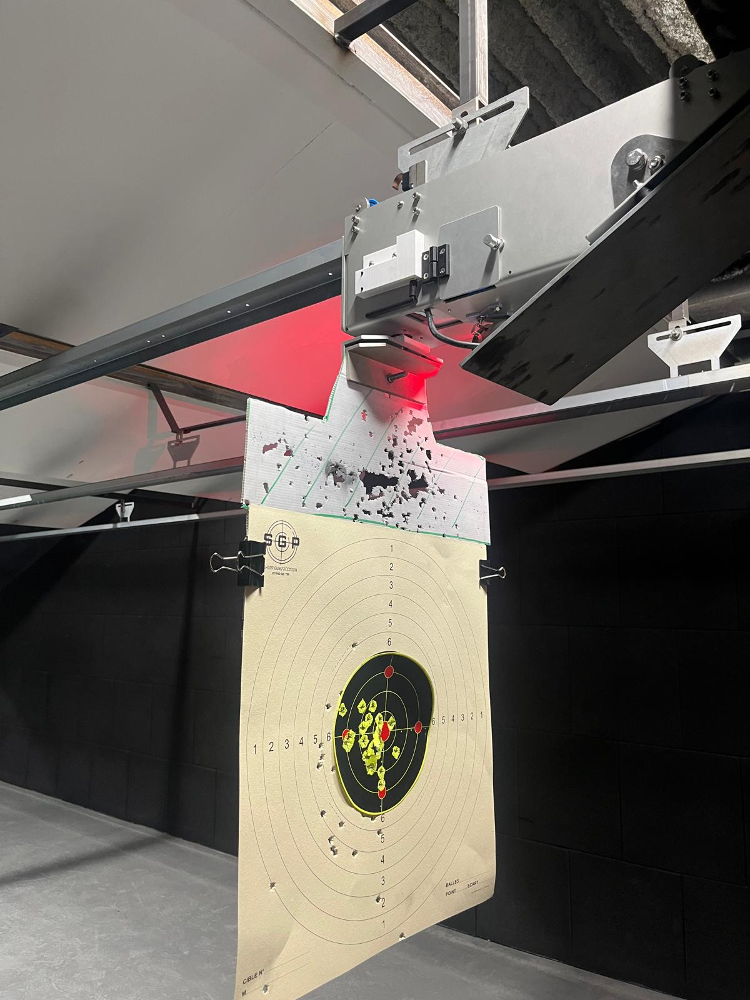
  &nbsp;
  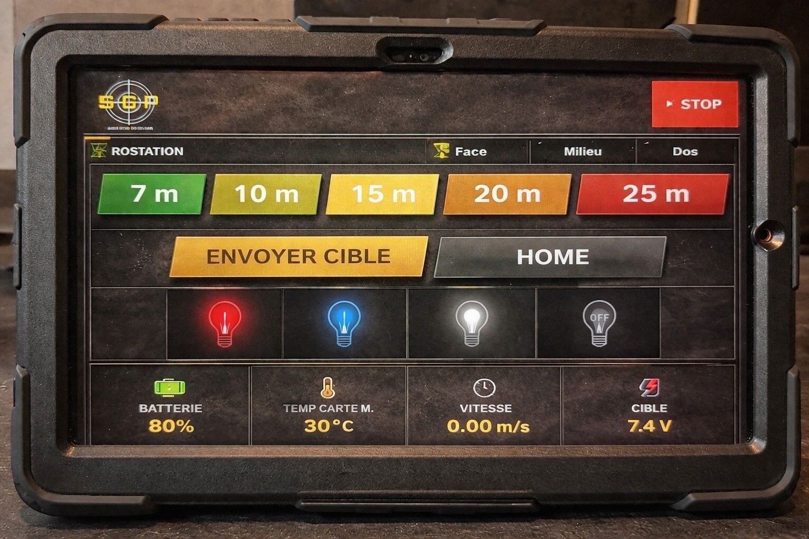
</p>
<p align="center"><em>Left: the target board after a live session — the position-control loop reliably parked the robot at the commanded distances. Right: the wireless tablet dashboard (distance presets, live telemetry, target orientation, spot lighting).</em></p>

## Project outcome

The retrofit is **fully operational**: the robot accepts a target distance from the tablet (preset buttons or manual fine adjustment), drives there under closed-loop LiDAR feedback, holds position accurately enough for competitive shooting, detects impacts on the target via unexpected wheel motion while parked, and automatically returns home after an operator unlocks the safety prompt. Every safety interlock described below (LiDAR signal loss, overcurrent/overheat, mechanical stall) was implemented and is active in the deployed firmware.

## System architecture

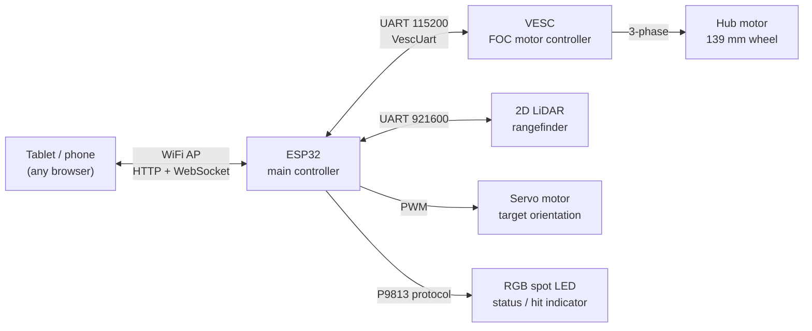

| Signal | ESP32 pin | Peripheral pin |
|---|---|---|
| VESC UART | GPIO 16 (RX) / 17 (TX) | TX / RX |
| VESC 5V | — | powers the LiDAR's 5V rail (shared, for a stable supply) |
| LiDAR UART | GPIO 14 (RX) / 27 (TX) | TX / RX |
| Servo PWM | GPIO 5 | signal (brown = GND, red = 5V) |
| P9813 LED driver | GPIO 19 (clock) / 23 (data) | CIN / DIN |

**Motor**: hub motor, 139 mm wheel, configured in the VESC as a large outrunner (2000 g profile), 20 poles (10 pole pairs), sensorless FOC, 150 W max power loss, driven directly (no gearbox — the wheel *is* the motor rotor).

## Control theory: position servo as state feedback with integral action

The firmware implements the position loop as a discrete PID on the LiDAR distance error. That PID is not an arbitrary heuristic — it's the direct discretization of a **state-feedback controller with integral action**, the same design pattern used in this author's other control-theory projects ([`RST-controller-for-an-inverted-pendulum`](https://github.com/devkumar-projects/RST-controller-for-an-inverted-pendulum), [`Control-of-an-instable-system-using-digital-state-feedback`](https://github.com/devkumar-projects/Control-of-an-instable-system-using-digital-state-feedback)). The derivation below documents the theoretical basis for the structure that was empirically tuned on the physical system.

**Plant model.** Treating the hub-motor-driven cart as a first-order velocity system (duty cycle → acceleration, with viscous/back-EMF damping):

<p align="center">
  <picture>
    <source media="(prefers-color-scheme: dark)" srcset="docs/equations/eq1_plant_dark.png">
    
  </picture>
</p>

where `x₁` is position (measured by the LiDAR), `x₂` is velocity, `u ∈ [−1, 1]` is the commanded duty cycle, `a` is the effective damping coefficient, and `b` is the motor gain.

**Integral augmentation.** To reject steady-state error (static friction, cable drag, slope of the rail), the tracking error is integrated as an extra state:

<p align="center">
  <picture>
    <source media="(prefers-color-scheme: dark)" srcset="docs/equations/eq2_integral_dark.png">
    
  </picture>
</p>

**Augmented state-space system**, `X = [x₁, x₂, x₃]ᵀ`:

<p align="center">
  <picture>
    <source media="(prefers-color-scheme: dark)" srcset="docs/equations/eq3_statespace_dark.png">
    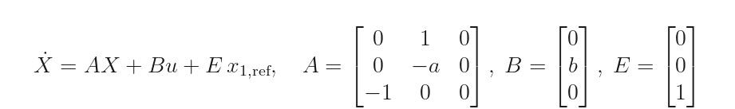
  </picture>
</p>

**Full-state feedback control law**:

<p align="center">
  <picture>
    <source media="(prefers-color-scheme: dark)" srcset="docs/equations/eq4_control_law_dark.png">
    
  </picture>
</p>

which is exactly a PID acting on the position error, with the derivative term taken on measured velocity (avoiding derivative kick on setpoint changes) rather than on the error itself. Substituting the control law back into the state equation gives the closed-loop system matrix `A_cl = A − BK`; the theoretical design method is to place the three closed-loop poles of `det(sI − A_cl) = 0` (e.g. via pole placement or an LQR cost) to hit a target settling time and damping ratio, which is what would determine `K_p`, `K_i`, `K_d` from `a` and `b` in a fully model-based design.

**What the firmware actually does** is the discrete-time version of this law, tuned empirically directly on the robot (since identifying `a` and `b` precisely for a friction-varying rail is impractical):

```cpp
float P = Kp * erreur;
integral = constrain(integral + erreur * dt, -1000, 1000);   // anti-windup clamp
float I = Ki * integral;
float D = Kd * (erreur - erreur_precedente);                  // discrete derivative
float target_duty = constrain(P + I + D, -dynamic_max_duty, dynamic_max_duty);
```

with a 20 ms control period (50 Hz), an **anti-windup clamp** on the integral term, a **slew-rate limiter** on the output duty cycle (`ACCEL_STEP`) to avoid current spikes through the VESC, and a **dynamically reduced maximum duty cycle** below 300 mm from the target for a soft, precise final approach.

**Wheel kinematics** — converting motor electrical RPM to linear speed and distance:

<p align="center">
  <picture>
    <source media="(prefers-color-scheme: dark)" srcset="docs/equations/eq5_wheel_rev_dark.png">
    
  </picture>
</p>

<p align="center">
  <picture>
    <source media="(prefers-color-scheme: dark)" srcset="docs/equations/eq6_speed_dark.png">
    
  </picture>
</p>

where `p = 10` is the number of pole pairs (20 poles), so mechanical RPM `= ERPM/p`.

## Firmware behavior (main control loop)

1. **Network + sensor processing** — handles incoming HTTP/WebSocket requests, then reads and low-pass filters (0.6/0.4 coefficient) the LiDAR frame.
2. **LiDAR signal-loss safety** — if no valid LiDAR frame arrives for 500 ms while moving, the robot brakes immediately and the spot LED turns red.
3. **Telemetry broadcast** — every 500 ms, battery voltage, motor current, MOSFET temperature, and speed are read from the VESC and pushed to every connected client as JSON over WebSocket.
4. **Movement branch** (state-feedback/PID, above) — runs at 50 Hz while a target distance is active; stops and actively brakes (5 A brake current) once the error is under 120 mm and duty is under 5%. Overcurrent (>20 A) or overheat (>75°C) triggers an immediate stop.
5. **Hit-detection branch** — while parked, the firmware polls the VESC's RPM every 20 ms; unexpected wheel rotation (>0.20 RPM), occurring at least 5 seconds after the last move and only when the robot isn't already home, is interpreted as an impact. It lights the LED red, raises a `hittarget` flag broadcast to the tablet (triggering a full-screen alert requiring a 4-digit unlock code), and automatically drives the robot home once acknowledged.
6. **Stall safety** — if the measured distance hasn't moved by more than 10 mm in 2 seconds despite an active duty command above 10%, the robot is considered mechanically stuck and stops.

## Wireless HMI

The ESP32 serves a self-contained single-page web app (no external hosting needed) over its own WiFi access point, with live state pushed over WebSocket:

- distance presets (7/10/15/20/24 m) plus manual ±1 m fine adjustment
- target orientation control (front / middle / back) via the servo
- spot-light color control (blue / white / off / red-on-hit)
- live telemetry: voltage, battery %, MOSFET temperature, speed, measured position
- a full-screen hit alert with a 4-digit unlock code, so a hit must be acknowledged by an operator before the robot resumes normal operation

## Mechanical design

Custom enclosure and mounts designed for this retrofit, 3D-printed and integrated onto the existing rail chassis:

<p align="center">
  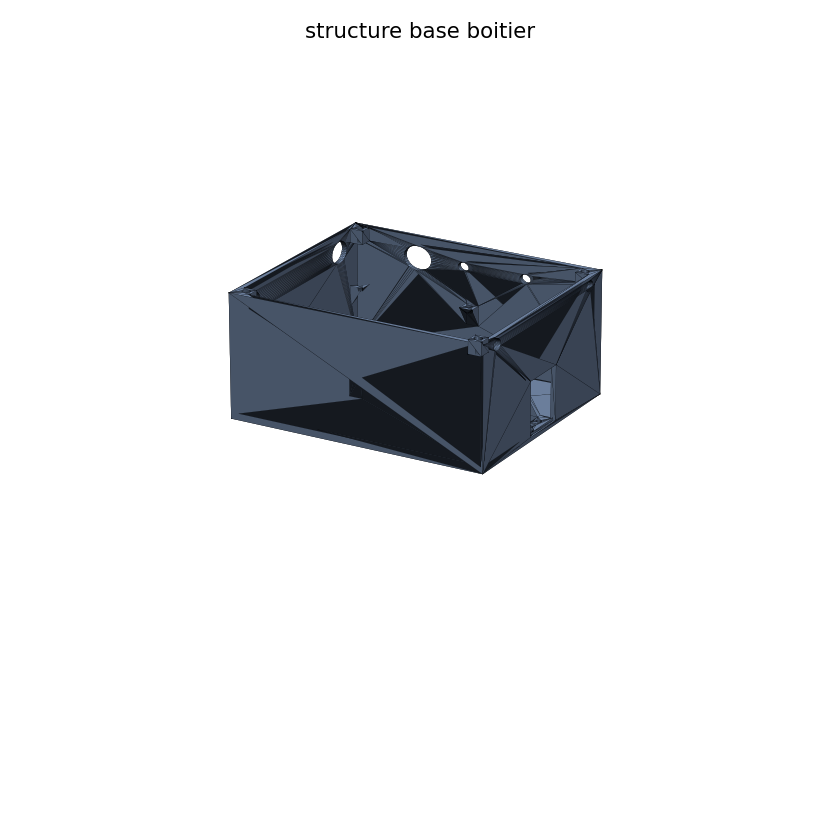
  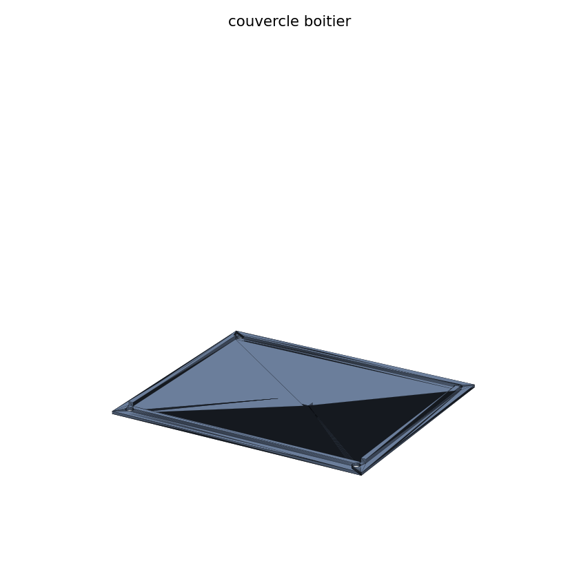
  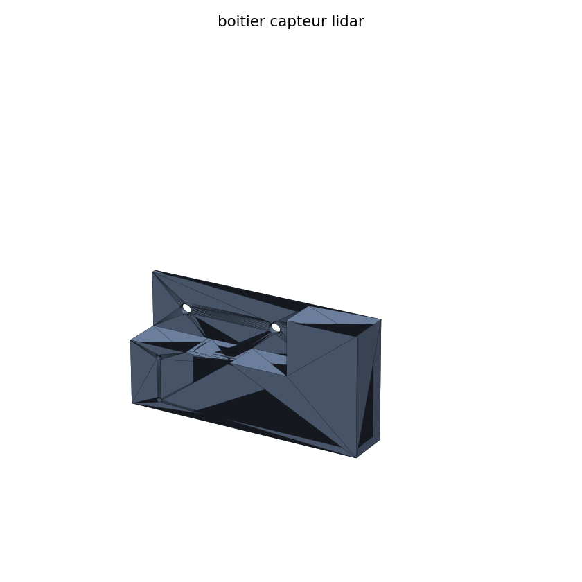
</p>
<p align="center">
  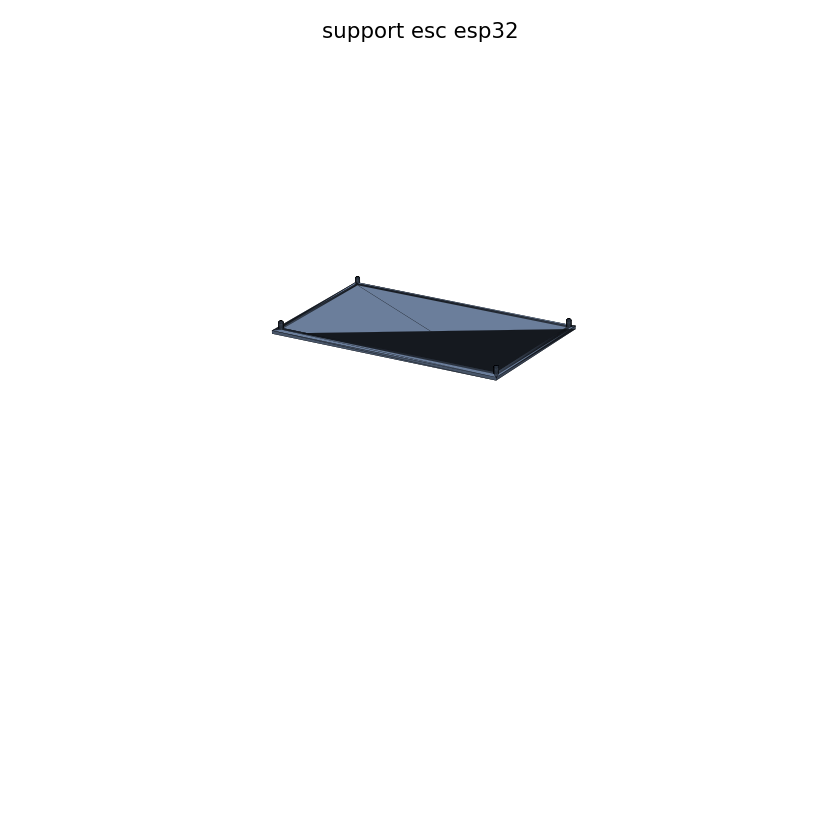
  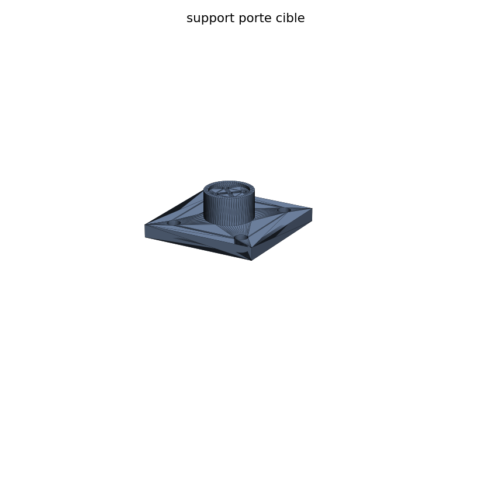
  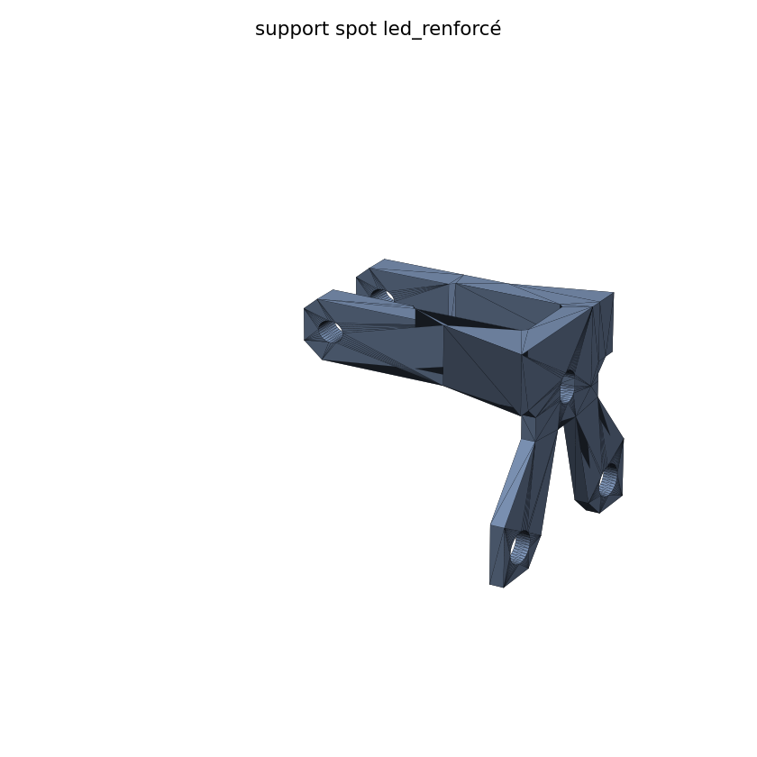
</p>
<p align="center"><em>Renders generated directly from the STL files in this repository (matplotlib, shaded by face normals) — not marketing images.</em></p>

<p align="center">
  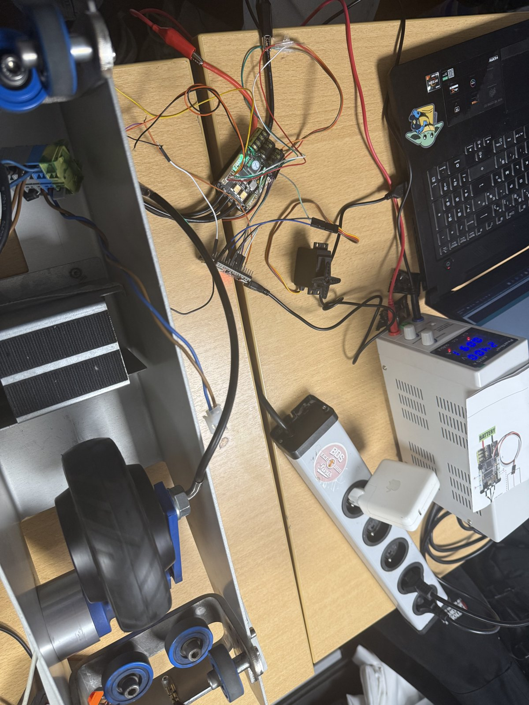
  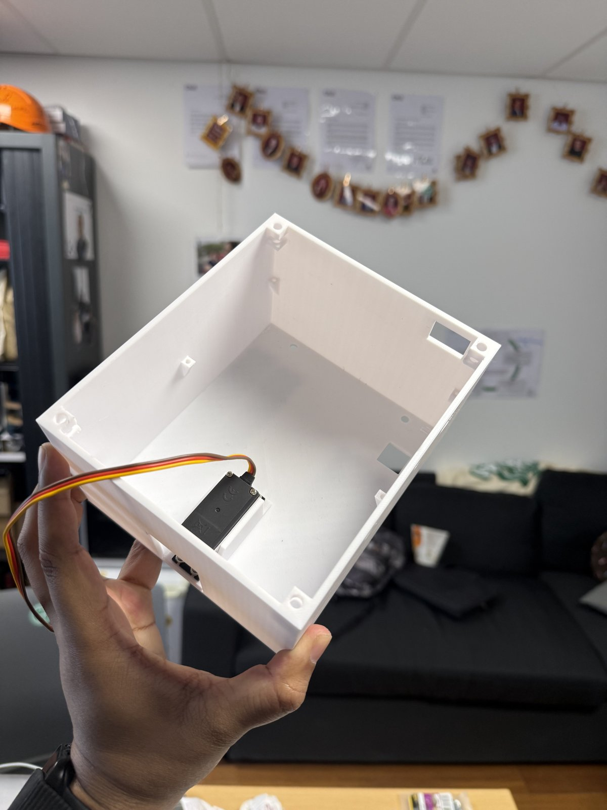
  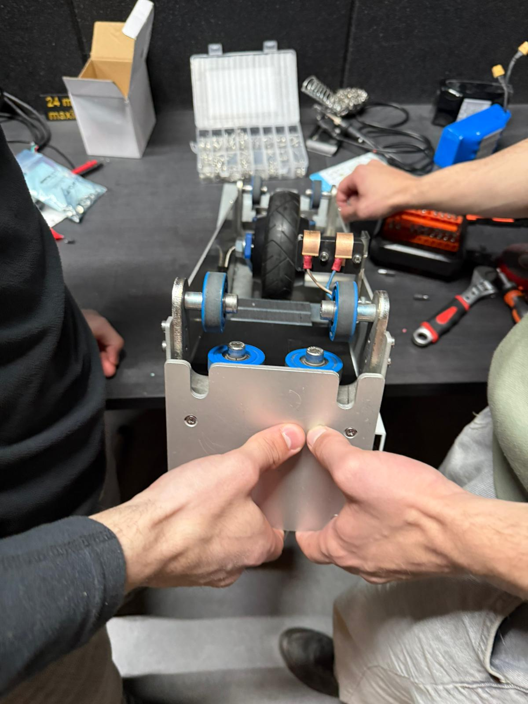
</p>
<p align="center"><em>The 3D-printed parts as manufactured, and the hub-motor drivetrain being assembled onto the rail carriage.</em></p>

Six parts were designed (STEP + STL provided in [`mechanical-cad/`](mechanical-cad)): the enclosure's base structure and lid, a dedicated LiDAR sensor housing, a mount for the ESC and ESP32, a mount for the target holder, and a reinforced mount for the spotlight (this last one needed reinforcing after the original print proved too fragile in testing — a reminder that first-iteration 3D-printed brackets rarely survive first contact with a shooting range).

## Electronics

- **Schematic**: designed in KiCad — [`electronics-kicad/projet_falc.kicad_sch`](electronics-kicad/projet_falc.kicad_sch)
- **PCB**: a KiCad PCB project file is included, but no copper layout was finalized for this phase — the schematic and point-to-point wiring table above are the actual deliverable used in the field.

<p align="center">
  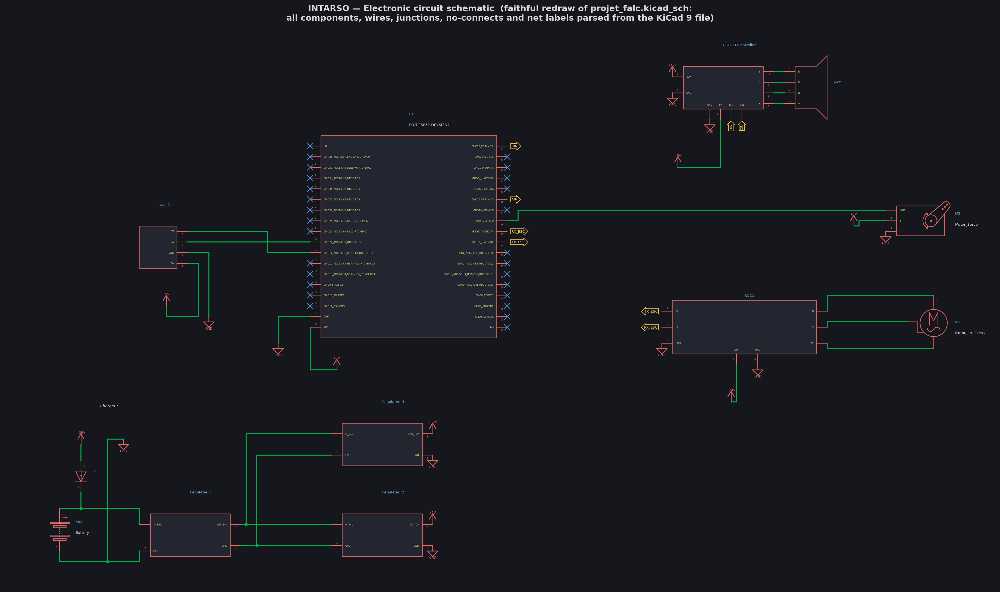
</p>
<p align="center"><em>Faithful redraw of <code>projet_falc.kicad_sch</code>: every symbol's real body graphics, pins, wires, junctions, no-connects and net labels (DIN/CIN, TX_ESC/RX_ESC) parsed straight from the KiCad 9 file — connectivity machine-verified (103/103 pins attached, 0 dangling wires). Visible blocks: ESP32 dev kit, VESC ESC + brushless hub motor, MOSFET module driving the RGB spot, servo, TOF/LiDAR rangefinder, and the 36V battery → 24V → 12V/5V regulator chain.</em></p>

## Repository layout

```
firmware/
├── main_controller/            Full ESP32 firmware: WiFi AP, HTTP+WebSocket server,
│                                state-feedback/PID position loop, hit detection,
│                                safety interlocks, embedded HTML/JS tablet UI
└── tests_and_calibration/       Standalone unit tests used during bring-up
    ├── lidar_test/               Raw LiDAR frame parsing test
    ├── servo_sweep_test/         Basic servo sweep
    ├── servo_pulse_calibration/  Servo min/max pulse-width calibration
    ├── led_test/                 P9813 RGB spot LED test
    └── vesc_uart_test/           VESC UART link test (read telemetry + send duty)

electronics-kicad/               KiCad schematic, symbol library, project files
mechanical-cad/
├── step/                        Editable CAD (STEP) for all 6 printed parts
├── stl/                         Print-ready STL for all 6 printed parts
└── renders/                     Shaded preview renders generated from the STLs
docs/photos/                     Real photos: target after a session, tablet HMI,
                                  3D-printed parts, drivetrain assembly
```

## Skills demonstrated

- **Embedded systems**: ESP32 firmware architecture, multi-peripheral UART management (VESC + LiDAR sharing a single MCU), non-blocking main-loop design under a WiFi server and WebSocket broadcast
- **Control theory**: state-space modeling, integral-augmented state feedback, discrete PID implementation with anti-windup and slew-rate limiting, informed by pole-placement/LQR design principles
- **Motor control**: VESC FOC configuration for a sensorless hub motor (pole count, power limits, UART app mode), ERPM-to-linear-speed kinematics
- **Sensor integration**: UART LiDAR frame parsing with checksum validation and low-pass filtering
- **Safety-critical design**: multiple independent interlocks (signal loss, overcurrent/overheat, mechanical stall, unexpected motion) that fail toward a safe stop
- **Full-stack embedded UI**: a complete HTML/CSS/JS single-page app served directly from ESP32 flash, communicating over HTTP + WebSocket with no external dependency
- **Electronics**: schematic capture in KiCad
- **Mechanical design**: parametric CAD for a custom enclosure and sensor/actuator mounts, iterated based on real-world failure (the reinforced spotlight mount)

## Note on excluded deliverables

The original project deliverables (a detailed PDF/DOCX report and wiring synoptic, written in French for the client) are not included in this repository — the content relevant to understanding and reproducing the system has been translated and restructured into this README instead.

## License

MIT — see [LICENSE](LICENSE).

---

*Authors — Dev Kumar & [Tedjeddine Sebiane](https://www.linkedin.com/in/tedjeddinesebiane), in collaboration with JEECE · AMJE Arts et Métiers Junior Études*
